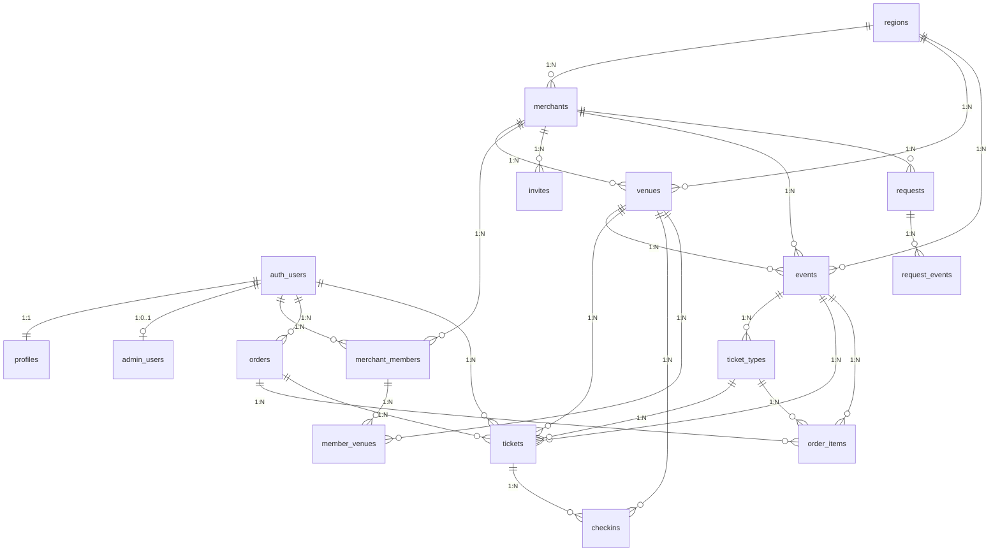

# 数据库结构概览文档

> 基于 migrations 001-018 分析生成  
> 生成时间: 2026-01-20

---

## Phase 0: 环境自检结果

### Supabase CLI 版本
```
2.72.8
```

### Supabase Status
```
❌ Docker Desktop 未运行（本地开发环境）
✅ 已配置 supabase link 和远程数据库连接
```

### Schema 文件位置
```
❌ supabase/remote_schema/supabase_schema.sql (不存在)
✅ 使用 migrations/ 目录下的 SQL 文件进行分析
```

---

## Phase 1: Schema 摘要

### 1.1 全部 Tables（共 21 张表）

#### Core Tables (Customer + Merchant Common)
1. **profiles** - 用户档案（1:1 with auth.users）
2. **regions** - 地区
3. **merchants** - 商户
4. **venues** - 场地

#### Internal Merchant Tables
5. **merchant_members** - 商户成员（员工/经理/所有者）
6. **member_venues** - 员工场地权限
7. **invites** - 邀请码
8. **admin_users** - 管理员用户

#### Events & Ticketing
9. **events** - 活动
10. **ticket_types** - 票种
11. **orders** - 订单
12. **order_items** - 订单项
13. **tickets** - 票券
14. **checkins** - 核销记录
15. **stripe_events** - Stripe 事件日志

#### Requests System
16. **requests** - 申请（审批制）
17. **request_events** - 申请事件审计

#### Admin Portal Extensions
18. **audit_logs** - 审计日志
19. **export_tasks** - 导出任务

---

### 1.2 表结构详情

#### profiles
```sql
CREATE TABLE public.profiles (
  id UUID PRIMARY KEY REFERENCES auth.users(id) ON DELETE CASCADE,
  display_name TEXT,
  avatar_url TEXT,
  phone TEXT,
  last_region_id UUID,
  default_merchant_id UUID,
  default_venue_id UUID,
  is_admin BOOLEAN NOT NULL DEFAULT false,  -- Migration 010
  created_at TIMESTAMPTZ NOT NULL DEFAULT NOW(),
  updated_at TIMESTAMPTZ NOT NULL DEFAULT NOW()
);
```

**索引:**
- `idx_profiles_is_admin` (WHERE is_admin = true)

**触发器:**
- `trg_profiles_updated_at` - 自动更新 updated_at

**外键:**
- `id` → `auth.users(id)` (CASCADE)

---

#### regions
```sql
CREATE TABLE public.regions (
  id UUID PRIMARY KEY DEFAULT gen_random_uuid(),
  name TEXT NOT NULL,
  state TEXT,
  country TEXT DEFAULT 'US',
  lat DOUBLE PRECISION,
  lng DOUBLE PRECISION,
  is_active BOOLEAN NOT NULL DEFAULT true,
  status TEXT DEFAULT 'Operational' CHECK (status IN ('Operational', 'Maintenance')),  -- Migration 007
  created_at TIMESTAMPTZ NOT NULL DEFAULT NOW(),
  updated_at TIMESTAMPTZ NOT NULL DEFAULT NOW(),
  UNIQUE (name, state, country)
);
```

**索引:**
- `idx_regions_active` (is_active)
- `idx_regions_status` (status)

**触发器:**
- `trg_regions_updated_at` - 自动更新 updated_at

---

#### merchants
```sql
CREATE TABLE public.merchants (
  id UUID PRIMARY KEY DEFAULT gen_random_uuid(),
  region_id UUID NOT NULL REFERENCES public.regions(id),
  name TEXT NOT NULL,
  status TEXT NOT NULL DEFAULT 'active' CHECK (status IN ('active','suspended','closed')),
  default_venue_id UUID REFERENCES public.venues(id) ON DELETE SET NULL,  -- Migration 014
  created_at TIMESTAMPTZ NOT NULL DEFAULT NOW(),
  updated_at TIMESTAMPTZ NOT NULL DEFAULT NOW(),
  UNIQUE (region_id, name)
);
```

**索引:**
- `idx_merchants_region` (region_id)
- `idx_merchants_default_venue` (default_venue_id)
- `idx_merchants_default_venue_not_null` (default_venue_id WHERE default_venue_id IS NOT NULL)

**触发器:**
- `trg_merchants_updated_at` - 自动更新 updated_at
- `trg_ensure_merchant_default_venue` - 确保新 merchant 有 default_venue_id (Migration 016)

**外键:**
- `region_id` → `regions(id)`
- `default_venue_id` → `venues(id)` (SET NULL)

---

#### venues
```sql
CREATE TABLE public.venues (
  id UUID PRIMARY KEY DEFAULT gen_random_uuid(),
  merchant_id UUID NOT NULL REFERENCES public.merchants(id) ON DELETE CASCADE,
  region_id UUID NOT NULL REFERENCES public.regions(id),
  name TEXT NOT NULL,
  address TEXT,
  lat DOUBLE PRECISION,
  lng DOUBLE PRECISION,
  timezone TEXT DEFAULT 'America/New_York',
  is_active BOOLEAN NOT NULL DEFAULT true,
  created_at TIMESTAMPTZ NOT NULL DEFAULT NOW(),
  updated_at TIMESTAMPTZ NOT NULL DEFAULT NOW(),
  UNIQUE (merchant_id, name)
);
```

**索引:**
- `idx_venues_merchant` (merchant_id)
- `idx_venues_region` (region_id)

**触发器:**
- `trg_venues_updated_at` - 自动更新 updated_at

**外键:**
- `merchant_id` → `merchants(id)` (CASCADE)
- `region_id` → `regions(id)`

---

#### merchant_members
```sql
CREATE TABLE public.merchant_members (
  id UUID PRIMARY KEY DEFAULT gen_random_uuid(),
  merchant_id UUID NOT NULL REFERENCES public.merchants(id) ON DELETE CASCADE,
  user_id UUID NOT NULL REFERENCES auth.users(id) ON DELETE CASCADE,
  role TEXT NOT NULL CHECK (role IN ('staff','manager','owner','admin')),
  is_active BOOLEAN NOT NULL DEFAULT true,
  created_at TIMESTAMPTZ NOT NULL DEFAULT NOW(),
  updated_at TIMESTAMPTZ NOT NULL DEFAULT NOW(),
  UNIQUE (merchant_id, user_id)
);
```

**索引:**
- `idx_members_user` (user_id)
- `idx_members_merchant` (merchant_id)

**触发器:**
- `trg_members_updated_at` - 自动更新 updated_at

**外键:**
- `merchant_id` → `merchants(id)` (CASCADE)
- `user_id` → `auth.users(id)` (CASCADE)

---

#### admin_users
```sql
CREATE TABLE public.admin_users (
  user_id UUID PRIMARY KEY REFERENCES auth.users(id) ON DELETE CASCADE,
  is_active BOOLEAN NOT NULL DEFAULT true,
  created_at TIMESTAMPTZ NOT NULL DEFAULT NOW()
);
```

**索引:**
- `idx_admin_users_active` (is_active)

**外键:**
- `user_id` → `auth.users(id)` (CASCADE)

---

#### events
```sql
CREATE TABLE public.events (
  id UUID PRIMARY KEY DEFAULT gen_random_uuid(),
  region_id UUID NOT NULL REFERENCES public.regions(id),
  merchant_id UUID NOT NULL REFERENCES public.merchants(id) ON DELETE CASCADE,
  venue_id UUID NOT NULL REFERENCES public.venues(id) ON DELETE CASCADE,
  status TEXT NOT NULL DEFAULT 'draft' CHECK (status IN ('draft','pending_review','approved','published','rejected','archived')),
  title TEXT NOT NULL,
  description TEXT,
  poster_url TEXT,
  start_at TIMESTAMPTZ NOT NULL,
  end_at TIMESTAMPTZ NOT NULL,
  age_policy TEXT NOT NULL DEFAULT '21+' CHECK (age_policy IN ('21+','UNDER21','BOTH')),
  refund_policy TEXT NOT NULL DEFAULT 'no_refund' CHECK (refund_policy IN ('no_refund','24h','flexible','venue_policy','UNTIL_START','CUSTOM')),
  publish_at TIMESTAMPTZ,
  redeem_start_at TIMESTAMPTZ,  -- Migration 012
  redeem_end_at TIMESTAMPTZ,     -- Migration 012
  published_status TEXT DEFAULT 'DRAFT' CHECK (published_status IN ('DRAFT', 'PUBLISHED')),  -- Migration 012
  subtitle TEXT,                  -- Migration 012
  created_at TIMESTAMPTZ NOT NULL DEFAULT NOW(),
  updated_at TIMESTAMPTZ NOT NULL DEFAULT NOW(),
  CONSTRAINT events_time_ok CHECK (end_at > start_at)
);
```

**索引:**
- `idx_events_region_status_time` (region_id, status, start_at)
- `idx_events_merchant` (merchant_id)
- `idx_events_venue` (venue_id)
- `idx_events_published_status` (published_status)
- `idx_events_redeem_window` (redeem_start_at, redeem_end_at)

**触发器:**
- `trg_events_updated_at` - 自动更新 updated_at

**外键:**
- `region_id` → `regions(id)`
- `merchant_id` → `merchants(id)` (CASCADE)
- `venue_id` → `venues(id)` (CASCADE)

---

#### orders
```sql
CREATE TABLE public.orders (
  id UUID PRIMARY KEY DEFAULT gen_random_uuid(),
  user_id UUID NOT NULL REFERENCES auth.users(id) ON DELETE RESTRICT,
  region_id UUID REFERENCES public.regions(id),
  status TEXT NOT NULL DEFAULT 'pending_payment' CHECK (status IN ('created','pending_payment','paid','fulfilled','expired','canceled','refunded','partially_refunded')),
  amount_cents INTEGER NOT NULL CHECK (amount_cents >= 0),
  currency TEXT NOT NULL DEFAULT 'usd',
  stripe_checkout_session_id TEXT,
  stripe_payment_intent_id TEXT,
  stripe_customer_id TEXT,
  idempotency_key TEXT,
  created_at TIMESTAMPTZ NOT NULL DEFAULT NOW(),
  updated_at TIMESTAMPTZ NOT NULL DEFAULT NOW()
);
```

**索引:**
- `uq_orders_idempotency` UNIQUE (idempotency_key WHERE idempotency_key IS NOT NULL)
- `uq_orders_stripe_checkout_session` UNIQUE (stripe_checkout_session_id WHERE stripe_checkout_session_id IS NOT NULL)
- `uq_orders_stripe_payment_intent` UNIQUE (stripe_payment_intent_id WHERE stripe_payment_intent_id IS NOT NULL)
- `idx_orders_user_created` (user_id, created_at DESC)

**触发器:**
- `trg_orders_updated_at` - 自动更新 updated_at

**外键:**
- `user_id` → `auth.users(id)` (RESTRICT)
- `region_id` → `regions(id)`

---

### 1.3 Enums/Types

#### Status Enums
- **merchants.status**: `'active' | 'suspended' | 'closed'`
- **events.status**: `'draft' | 'pending_review' | 'approved' | 'published' | 'rejected' | 'archived'`
- **events.published_status**: `'DRAFT' | 'PUBLISHED'`
- **regions.status**: `'Operational' | 'Maintenance'`
- **orders.status**: `'created' | 'pending_payment' | 'paid' | 'fulfilled' | 'expired' | 'canceled' | 'refunded' | 'partially_refunded'`
- **tickets.status**: `'issued' | 'active' | 'used' | 'refunded' | 'void' | 'expired'`
- **requests.status**: `'pending' | 'approved' | 'rejected' | 'withdrawn'`
- **export_tasks.status**: `'PROCESSING' | 'READY' | 'FAILED'`

#### Role Enums
- **merchant_members.role**: `'staff' | 'manager' | 'owner' | 'admin'`
- **invites.intended_role**: `'staff' | 'manager' | 'owner' | 'admin'`

#### Category Enums
- **ticket_types.category**: `'ENTRY' | 'DRINK' | 'VIP' | 'SKIP_LINE'`
- **ticket_types.age_requirement**: `'NONE' | '18_PLUS' | '21_PLUS'`
- **ticket_types.status**: `'DRAFT' | 'ACTIVE' | 'HIDDEN'`

---

### 1.4 Views

无自定义视图。

---

### 1.5 Functions (SECURITY DEFINER)

#### Helper Functions (避免 RLS 递归)

1. **`public.is_admin()`** - 检查当前用户是否为管理员
   - **Security**: `SECURITY DEFINER`
   - **Logic**: 检查 `profiles.is_admin` 或 `admin_users` 表 (Migration 010)
   - **风险**: 低（只读查询）

2. **`public.my_merchant_ids()`** - 获取当前用户拥有的 merchant_ids
   - **Security**: `SECURITY DEFINER`
   - **Logic**: 从 `merchant_members` 表查询
   - **风险**: 低（只读查询）

3. **`public.has_merchant_role(p_merchant_id UUID, p_roles TEXT[])`** - 检查用户对某商户的角色
   - **Security**: `SECURITY DEFINER`
   - **Logic**: 查询 `merchant_members` 表
   - **风险**: 低（只读查询）

4. **`public.my_venue_ids()`** - 获取用户可访问的 venue_ids
   - **Security**: `SECURITY DEFINER`
   - **Logic**: 基于 `merchant_members` 和 `member_venues` 计算
   - **风险**: 低（只读查询）

#### RPC Functions

5. **`public.redeem_invite(p_token TEXT)`** - 兑换邀请码
   - **Security**: `SECURITY DEFINER`
   - **Logic**: 创建 merchant_members，更新 invites.used_count
   - **风险**: 中等（写入操作，但已校验权限）

6. **`public.log_audit(...)`** - 创建审计日志
   - **Security**: `SECURITY DEFINER`
   - **Logic**: 插入 audit_logs 表
   - **风险**: 低（仅 admin 可调用）

#### Trigger Functions

7. **`public.set_updated_at()`** - 更新 updated_at 字段
   - **Security**: 普通函数
   - **风险**: 无

8. **`public.handle_new_user()`** - 自动创建 profile (Migration 018)
   - **Security**: `SECURITY DEFINER`
   - **Logic**: 在 `auth.users` INSERT 后创建 `profiles` 记录
   - **风险**: 低（仅用于自动创建 profile）

9. **`public.normalize_invite_token()`** - 规范化 invite token
   - **Security**: 普通函数
   - **风险**: 无

10. **`public.ensure_merchant_default_venue()`** - 确保 merchant 有 default_venue_id (Migration 016)
    - **Security**: 普通函数
    - **风险**: 低（仅用于自动创建 venue）

---

## Phase 2: 安全与权限

### 2.1 RLS 启用状态

**所有表均已启用 RLS** (19 张表)

---

### 2.2 RLS Policies 详情

#### profiles
- **SELECT**: `profiles_read_own` - `id = auth.uid()`
- **UPDATE**: `profiles_update_own` - `id = auth.uid()`
- **INSERT**: `profiles_insert_own` - `id = auth.uid()`

**问题识别:**
- ✅ INSERT policy 允许用户创建自己的 profile
- ⚠️ 但首次登录时，前端可能无法 INSERT（因为 RLS 需要 auth.uid()，但 session 可能未就绪）
- ✅ Migration 018 已通过 trigger 自动创建 profile（绕过 RLS）

---

#### admin_users
- **SELECT**: `admin_users_read_admin` - `public.is_admin()`
- **ALL**: `admin_users_manage_admin` - `public.is_admin()`

**问题识别:**
- ⚠️ 只有 admin 可以查询 `admin_users` 表
- ⚠️ Middleware 查询 `admin_users` 时，如果用户不是 admin，会返回空（导致误判为非 admin）
- ✅ 解决方案：Middleware 应使用 service role client 查询

---

#### merchant_members
- **SELECT**: `members_read_own` - `user_id = auth.uid() OR public.is_admin() OR merchant_id = ANY(public.my_merchant_ids())`
- **ALL**: `members_manage_owner` - `public.is_admin() OR public.has_merchant_role(merchant_id, ARRAY['owner','manager'])`

**问题识别:**
- ✅ 用户可以查询自己的 memberships
- ✅ Owner/Manager 可以查询同商户的 members

---

#### merchants
- **SELECT**: 
  - `merchants_read_active` - `status = 'active'` (公开)
  - `merchants_read_member` - `public.is_admin() OR id = ANY(public.my_merchant_ids())`
- **UPDATE**: `merchants_manage_owner` - `public.is_admin() OR public.has_merchant_role(id, ARRAY['owner'])`

**问题识别:**
- ✅ 公开可读 active merchants
- ✅ Members 可读自己的 merchants

---

#### venues
- **SELECT**: 
  - `venues_read_active` - `is_active = true` (公开)
  - `venues_read_merchant` - `public.is_admin() OR merchant_id = ANY(public.my_merchant_ids())`
- **ALL**: `venues_manage_manager` - `public.is_admin() OR public.has_merchant_role(merchant_id, ARRAY['owner','manager'])`

**问题识别:**
- ✅ 公开可读 active venues
- ✅ Members 可读自己的 venues

---

#### events
- **SELECT**: 
  - `events_read_published` - `status = 'published'` (公开)
  - `events_read_merchant` - `public.is_admin() OR merchant_id = ANY(public.my_merchant_ids())`
- **ALL**: `events_manage_manager` - `public.is_admin() OR public.has_merchant_role(merchant_id, ARRAY['owner','manager'])`

**问题识别:**
- ✅ 公开可读 published events
- ✅ Members 可读自己的 events

---

#### invites
- **SELECT**: `invites_read_merchant` - `public.is_admin() OR public.has_merchant_role(merchant_id, ARRAY['owner','manager'])`
- **INSERT/UPDATE**: ❌ 无 policy（禁止直接写入，只能通过 RPC）

**问题识别:**
- ✅ 禁止前端直接写入 invites（安全）

---

### 2.3 SECURITY DEFINER Functions 风险分析

| Function | 风险等级 | 说明 |
|----------|---------|------|
| `is_admin()` | 低 | 只读查询，无副作用 |
| `my_merchant_ids()` | 低 | 只读查询，无副作用 |
| `has_merchant_role()` | 低 | 只读查询，无副作用 |
| `my_venue_ids()` | 低 | 只读查询，无副作用 |
| `redeem_invite()` | 中 | 写入操作，但已校验权限和 invite 有效性 |
| `log_audit()` | 低 | 仅 admin 可调用 |
| `handle_new_user()` | 低 | 仅用于自动创建 profile，无权限提升风险 |

---

## Phase 3: 身份与三端角色模型

### 3.1 Auth Users 关联表

1. **profiles** (1:1)
   - `id` → `auth.users(id)` (CASCADE)
   - 包含 `is_admin` 字段（Migration 010）

2. **admin_users** (1:0..1)
   - `user_id` → `auth.users(id)` (CASCADE)
   - `is_active` 字段

3. **merchant_members** (1:N)
   - `user_id` → `auth.users(id)` (CASCADE)
   - `role`: `'staff' | 'manager' | 'owner' | 'admin'`

4. **orders** (1:N)
   - `user_id` → `auth.users(id)` (RESTRICT)

5. **tickets** (1:N)
   - `user_id` → `auth.users(id)` (RESTRICT)

---

### 3.2 三端身份判定逻辑

#### Admin 判定
```sql
-- 方法 1: profiles.is_admin = true
-- 方法 2: admin_users 表中有记录且 is_active = true
-- 函数: public.is_admin() (Migration 010)
```

**Source of Truth:**
- `profiles.is_admin` (优先)
- `admin_users.is_active = true` (向后兼容)

**问题:**
- ⚠️ Middleware 查询 `admin_users` 时，如果用户不是 admin，RLS 会阻止查询（返回空）
- ✅ 解决方案：Middleware 使用 service role client 查询

---

#### Merchant 判定
```sql
-- 查询 merchant_members 表
-- WHERE user_id = auth.uid() AND is_active = true
-- 函数: public.my_merchant_ids()
```

**Source of Truth:**
- `merchant_members` 表

**问题:**
- ✅ 用户可以查询自己的 memberships（RLS 允许）

---

#### Customer 判定
```sql
-- 默认所有登录用户都是 customer
-- 无需额外表或字段
```

**Source of Truth:**
- 所有 `auth.users` 都是潜在的 customer

---

### 3.3 潜在冲突/死循环/401/403 点

#### 1. Profiles 首次登录创建失败 (RLS 42501)
**问题:**
- 前端尝试 INSERT profiles 时，如果 session 未就绪，`auth.uid()` 返回 NULL，导致 RLS 失败

**已修复:**
- ✅ Migration 018: `handle_new_user()` trigger 自动创建 profile（SECURITY DEFINER，绕过 RLS）

**验证:**
- ✅ Trigger 已创建
- ⚠️ 需要验证 trigger 是否正常工作

---

#### 2. Admin 登录后重定向/鉴权误判
**问题:**
- Middleware 查询 `admin_users` 时，如果用户不是 admin，RLS 会阻止查询（返回空），导致误判为非 admin

**已修复:**
- ✅ `/api/me` 使用 service role client 查询 `admin_users`
- ⚠️ 需要验证 middleware 是否也使用 service role client

---

#### 3. Merchant 默认 Venue 为空导致 Create Event 无 Venue
**问题:**
- `merchants.default_venue_id` 可能为 NULL，导致创建 event 时无法选择 venue

**已修复:**
- ✅ Migration 014: 添加 `default_venue_id` 字段
- ✅ Migration 016: `redeem_invite()` 自动创建 default venue
- ✅ Migration 016: `trg_ensure_merchant_default_venue` trigger 确保新 merchant 有 default venue
- ⚠️ 需要验证历史数据是否已补齐

---

#### 4. 邀请码/场地/活动相关 RLS 与外键一致性
**问题:**
- `invites.merchant_id` 必须存在
- `invites.venue_id` 必须属于 `merchant_id`
- `events.venue_id` 必须属于 `merchant_id`

**已修复:**
- ✅ 外键约束已定义
- ✅ RLS policies 已定义
- ⚠️ 需要验证外键约束是否正常工作

---

## Phase 4: ERD 图



---

## Phase 5: 已知问题与修复建议

### 5.1 Profiles 首次登录创建失败
**状态**: ✅ 已修复（Migration 018）
**验证**: 需要测试 trigger 是否正常工作

### 5.2 Admin 登录后重定向/鉴权误判
**状态**: ⚠️ 部分修复（`/api/me` 使用 service role）
**待修复**: Middleware 应使用 service role client 查询

### 5.3 Merchant 默认 Venue 为空
**状态**: ✅ 已修复（Migration 014, 016）
**验证**: 需要验证历史数据是否已补齐

### 5.4 邀请码/场地/活动相关 RLS
**状态**: ✅ 已修复（外键约束 + RLS policies）
**验证**: 需要测试外键约束是否正常工作

---

## 下一步

1. ✅ 生成修复 migrations
2. ✅ 执行 `supabase db push`
3. ✅ 生成验收报告
